# 🌡️ PID Loop for a Quantum-Sensing Incubation System

---

This repository contains the documentation and core files from a **master’s thesis project** in biomedical engineering. The main focus was the design and implementation of a robust **PID (Proportional-Integral-Derivative) control loop** for a custom-built incubation system.

The system is intended for **long-term cultivation and observation of biological tissue samples**, with a special emphasis on integration into **wide-field microscopes** utilizing **nitrogen-vacancy (NV) centers in diamond** for quantum sensing.

---

## ✨ Project Goal

The objective was to enable **stable temperature and atmospheric control** inside an incubator specifically designed for high-resolution microscopy experiments. Specifically:

-   Cultivate **precision-cut tissue slices (PCTS)** of the colon under physiological conditions ($37\ ^{\circ}\text{C}$, controlled gas mixture).
-   Maintain optimal environmental conditions for **biocompatibility and long-term cell vitality**.
-   Allow **NV-based quantum sensing microscopy** to run long-term experiments without sample degradation.

---

## 🛠️ Methodology & System Components

The project involved the design and realization of a multi-component system, focusing on thermal, gas, and humidity control.

### Incubator Design and Thermal Control

The custom chamber was designed to fit precisely within the mechanical constraints of a wide-field microscope. Temperature stability was achieved using a heating wire wrapped around the core component, regulated by the custom Arduino-based PID loop.

  
   <em>CAD model of the custom incubator.</em>

  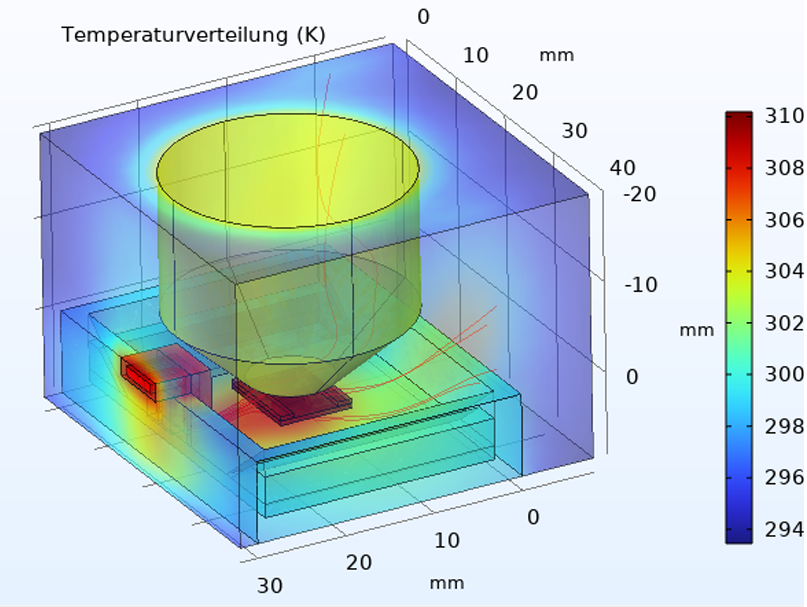
   <em>COMSOL thermal simulation result showing temperature distribution.</em>

### System Integration into Wide-Field Microscope

The final setup required careful mechanical and thermal integration into the existing microscopy stage.

  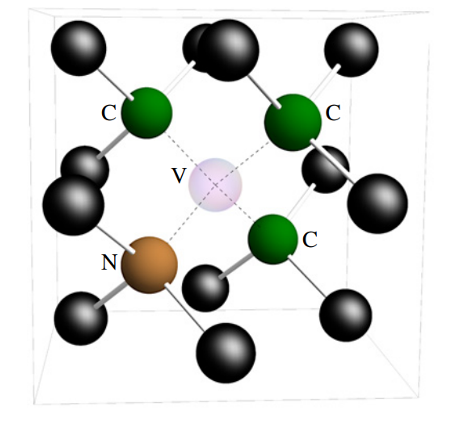
   <em>Schematic of the Nitrogen-Vacancy (NV) center lattice in diamond.</em>

  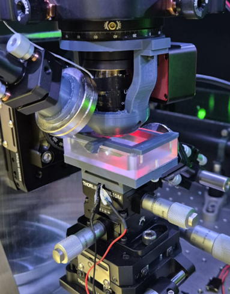
   <em>The realized physical incubator chamber integrated into the microscope setup.</em>

### Gas and Humidification Control

To mimic physiological conditions, the system required a precise, humidified mixture of **5% $\text{CO}_2$ and 95% air**.

  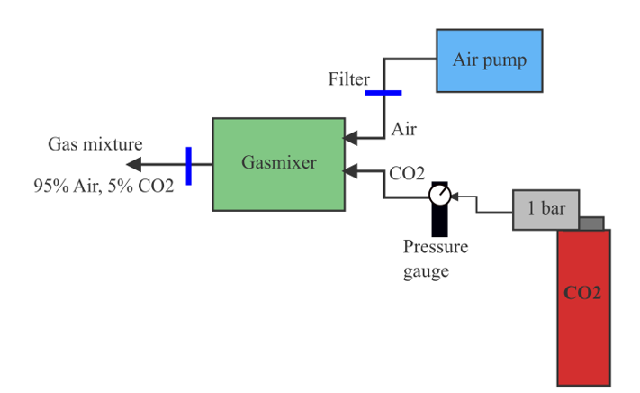
   <em>System concept for gas mixing and humidification.</em>

  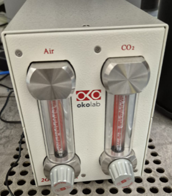
   <em>The realized CO2/Air Gas Mixer unit (OKOLAB).</em>

**Core Gas Components:**

  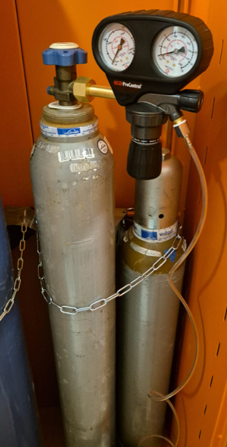
   <em>CO2 source and flow regulator.</em>

  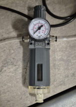
   <em>Pressure gauges used for regulating flow control.</em>

  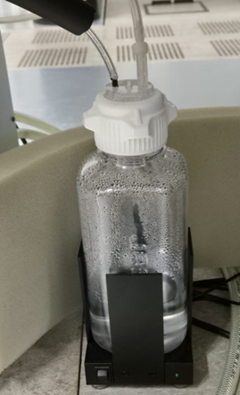
   <em>Humidifier component to saturate the gas mixture.</em>

  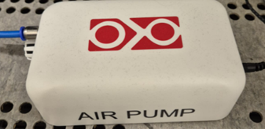
   <em>Air pump used for maintaining gas flow.</em>

### Electronics and PID Control Implementation

The entire temperature control system was built around an **Arduino Nano** microcontroller, implementing the PID loop and managing the NTC temperature feedback. The heating element is controlled via a **MOSFET switch** and an **external power source** to handle the required current, ensuring stable and reliable regulation.

  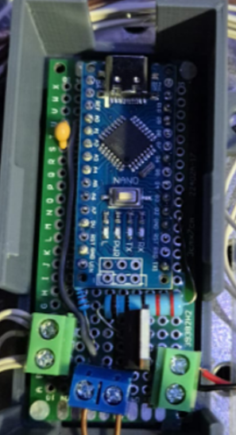
   <em>Photo of the realized Arduino Nano control unit, showing the integration of the microcontroller and the MOSFET for heater control.</em>

### Biological Sample Preparation

-   Experiments conducted with **colon tissue PCTS** to validate the system's ability to sustain viability.
-   Acquired microscopy images verified tissue vitality and structural integrity.

  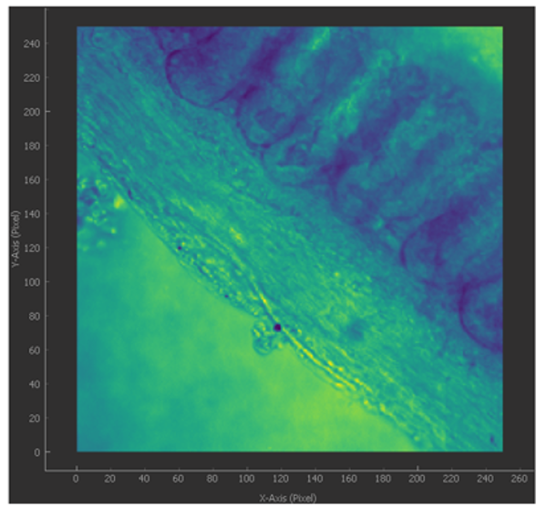

  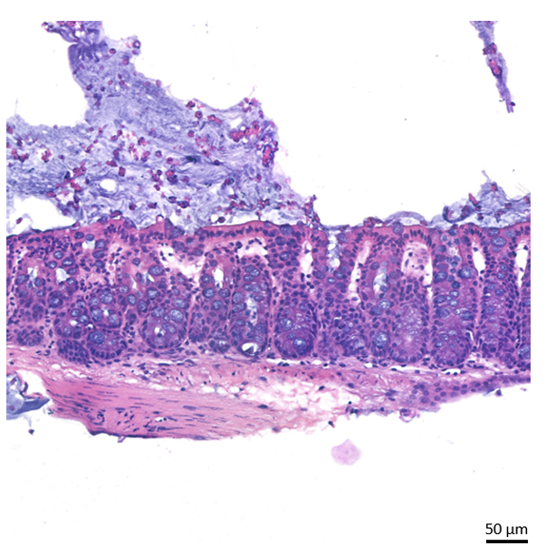
   <em>Brightfield (Top) and H&E stained (Bottom) images of mouse colon PCTS showing preserved tissue structure after cultivation.</em>

---

## 📈 Key Findings

-   The **PID control loop** successfully stabilized the temperature inside the incubator to $37\ ^{\circ}\text{C}$ with minimal overshoot and high precision.
-   **Tissue vitality** was maintained over the experimental period, confirming the **biocompatibility** of all materials and the efficacy of the gas/humidity control system.
-   Brightfield and stained microscopy images confirmed preserved tissue structure, validating the system for long-term experiments.

  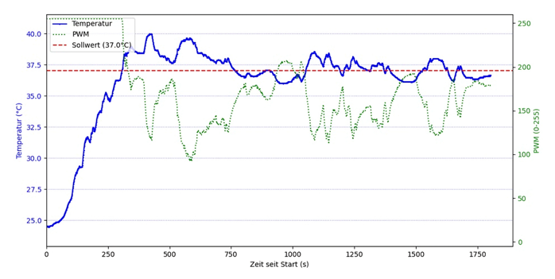
   
  <em>PID controller performance – stable regulation at physiological conditions (37 °C).</em>

---

## 💬 Discussion & Challenges

-   Designing an incubator that fits within the microscope setup posed severe **mechanical constraints** and required multiple CAD iterations.
-   **Thermal gradients** were minimized through careful heater placement and validated via COMSOL to ensure uniform tissue heating.
-   While PCTS cultivation showed promise, optimizing the system for **long-term single-cell suspensions** remains a challenge for future work.

---

## 📁 Repository Contents

| File | Description |
|:------|:-------------|
| `README.md` | Main project documentation |
| `Arduino_NTC_Resistor.ino` | Arduino sketch for NTC resistor temperature readout |
| `PIDcontrol.ino` | Arduino PID control implementation |
| `NTC Sensor Characterization.py` | Python script for NTC sensor calibration |
| `PID-python.py` | Python simulation of PID controller |
| `incubator.png` | **CAD render of the custom incubator chamber** |
| `chamber.png` | **Photo of the realized incubator chamber (real life)** |
| `nv.png` | NV lattice schematic (used for quantum sensing context) |
| `tdistribution.png` | COMSOL thermal simulation result |
| `gasconcept.png` | **Diagram of the gas control concept** |
| `gasmixer.png` | **Photo of the realized Gas Mixer unit** |
| `co2.png` | **Photo of the $\text{CO}_2$ source and flow regulator** |
| `gauge.png` | **Photo of the pressure gauges used for flow control** |
| `humidifier.png` | **Photo of the humidifier component** |
| `airpump.png` | **Photo of the air pump used for gas flow** |
| `arduinocircuit.png` | **Diagram of the core Arduino control circuit** |
| `brightfield.png` | Brightfield microscopy image of colon PCTS |
| `colon_he.png` | H&E stained colon image |
| `pidgraph.png` | PID performance graph |

---

## ✅ Conclusion

This thesis demonstrates the feasibility of building a **custom incubation system** with **PID-regulated temperature and atmospheric control**, suitable for seamless integration into a wide-field NV microscope setup.

The results confirm:
-   Stable maintenance of physiological conditions ($37\ ^{\circ}\text{C}$, 5% $\text{CO}_2$).
-   Viability of colon PCTS in cultivation experiments.
-   Potential for **long-term, high-precision NV-based quantum sensing studies in biology**.

---

## 🔮 Outlook

Future work will focus on:
-   Cultivation of **single-cell suspensions** (e.g., **HT29 colon tumor line**) for single-cell quantum measurements.
-   Observation of **long-term cell behavior** over multiple days.
-   Optimized integration of the incubator into the NV microscope for **high-precision quantum biological imaging**.

---

## 📄 Background & Related Work

This project builds upon advances in **NV-based quantum sensing** and **precision control in microscopy**.

**How NV centers detect magnetic fields (briefly):**
Nitrogen-vacancy (NV) centers in diamond act as **quantum sensors** because their electron spin states are sensitive to magnetic fields. By shining laser light and reading out their **spin-dependent fluorescence**, it is possible to detect extremely weak magnetic fields at the nanoscale, even under ambient conditions. This makes them ideal for biological imaging and long-term monitoring.

📄 

📄 

📄 
