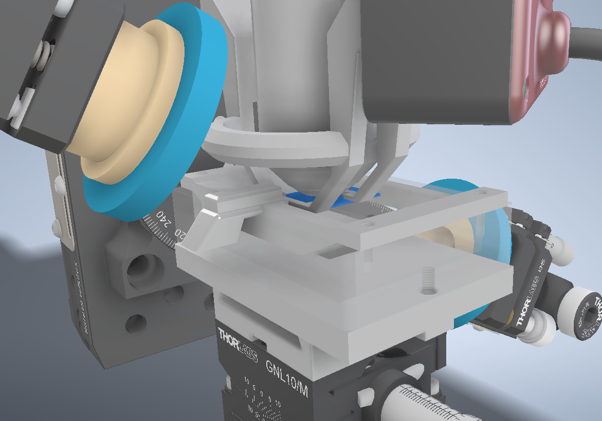

# 🌡️ PID Loop for an Incubation System

---

This repository contains the documentation and core files from a **master’s thesis project** in applied physics and biomedical engineering. The main focus was the design and implementation of a **PID (Proportional-Integral-Derivative) control loop** for a custom-built incubation system.  

The system is intended for **long-term cultivation and observation of biological tissue samples**, with a special emphasis on integration into **wide-field microscopes** utilizing **nitrogen-vacancy (NV) centers in diamond** for quantum sensing.

---

## ✨ Project Goal

The objective was to enable **stable temperature control** inside an incubator designed for microscopy experiments. Specifically:  
- Cultivate **precision-cut tissue slices (PCTS)** of the colon under physiological conditions.  
- Maintain optimal environmental conditions for **biocompatibility and cell vitality**.  
- Allow **NV-based quantum sensing microscopy** to run long-term experiments without sample degradation.  

---

## 🛠️ Methodology & Approach

The project involved multiple phases:  

### Incubator Design and Simulation  
- Custom chamber design tailored for integration into a wide-field microscope.  
- Performed **thermal simulations (COMSOL)** to model heat distribution.  
- CAD model of the incubator and thermal mapping results are shown below:  

  
  

  
   
  <em>CAD model, NV lattice, and COMSOL temperature distribution</em>

### Temperature Control with PID Loop  
- Implemented **PID controller** on Arduino for heating regulation.  
- Designed and tested custom heating setup.  
- PID parameters tuned to minimize overshoot and stabilize quickly.  

### Biological Sample Preparation  
- Conducted experiments with **colon tissue PCTS**.  
- Tested materials for **biocompatibility**.  
- Acquired microscopy images to verify tissue vitality.  

  
  

  <em>Brightfield and H&E stained images of mouse colon PCTS</em>

---

## 📈 Key Findings

- The PID control loop successfully stabilized the temperature inside the incubator.  
- **Tissue vitality** was maintained over time, confirming **biocompatibility** of materials.  
- Brightfield and stained microscopy images showed preserved tissue structure.  

  
   
  <em>PID controller performance – stable regulation at physiological conditions</em>

---

## 💬 Discussion & Challenges

- Designing an incubator that fits within the microscope setup posed **mechanical constraints**.  
- **Thermal gradients** had to be minimized to avoid uneven tissue heating.  
- Cultivation experiments showed promise, but **long-term cell suspensions** will require further optimization.  

---

## 📁 Repository Contents

| File | Description |
|------|-------------|
| `README.md` | Main project documentation |
| `Arduino_NTC_Resistor.ino` | Arduino script for NTC resistor temperature readout |
| `PIDcontrol.ino` | Arduino PID control implementation |
| `NTC Sensor Characterization.py` | Python script for NTC sensor calibration |
| `PID-python.py` | Python simulation of PID controller |
| `incubator.png` | CAD render of incubator |
| `nv.png` | NV lattice schematic |
| `tdistribution.png` | COMSOL simulation result |
| `brightfield.png` | Brightfield microscopy image of colon |
| `colon_he.png` | H&E stained colon image |
| `pidgraph.png` | PID performance graph |

---

## ✅ Conclusion

This thesis demonstrates the feasibility of building a **custom incubation system** with **PID-regulated temperature control**, suitable for integration into a wide-field NV microscope.  

The results confirm:  
- Stable maintenance of physiological conditions.  
- Viability of colon PCTS in cultivation experiments.  
- Potential for **long-term NV-based quantum sensing studies**.  

---

## 🔮 Outlook

Future work will focus on:  
- Cultivation of **single-cell suspensions** (e.g., **HT29 colon tumor line**).  
- Observation of **long-term cell behavior** over multiple days.  
- Optimized integration of the incubator into the NV microscope for **high-precision quantum biological imaging**.  

---

## 📄 Background & Related Work

📄   
📄 

